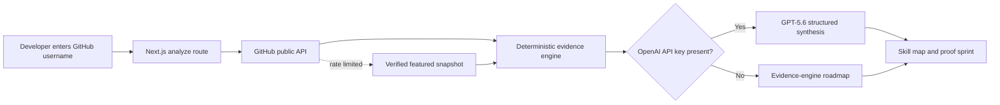

# ProofGarden

**Grow from what you have already built.**

[Try the live demo](https://repobloom-build-week.asta-aflc.chatgpt.site/) · [View the source](https://github.com/AnuranjanJain/OpenAIBuildWeek-July-26)

ProofGarden is an evidence-first learning coach for developers. It reads a public GitHub portfolio, maps demonstrated skills back to the repositories that prove them, finds the highest-leverage gaps, and creates a four-week learning sprint that upgrades existing work.

Generic roadmaps begin by asking what someone says they know. ProofGarden begins with what they have shipped.

## Why it exists

Developers have more tutorials, courses, and AI-generated plans than ever, but choosing the right next skill is still difficult. Most recommendations ignore the learner's actual history and produce another disconnected tutorial project.

ProofGarden makes three changes:

1. **Evidence over self-reporting.** Recommendations are linked to public repository signals.
2. **Existing work over throwaway exercises.** Each sprint upgrades a project the learner already owns.
3. **Proof over checkboxes.** Every week ends with a reproducible artifact: a test, benchmark, commit, demo, or decision record.

## Working features

- Analyze any public GitHub username without requiring a login.
- Map repository languages, topics, descriptions, stars, and recency into six skill signals.
- Inspect which repositories support each skill score.
- Identify three high-leverage focus areas.
- Generate a project-anchored four-week proof sprint.
- Let the learner choose the focus area and repository instead of accepting an opaque recommendation.
- Track completed proof artifacts locally and make the product visibly bloom as evidence accumulates.
- Export a mentor-ready learning contract as Markdown.
- Copy a bounded, Socratic Codex kickoff prompt for the selected repository.
- Inspect a visible evidence ledger instead of relying on unexplained scores or hover-only details.
- Use GPT-5.6 Structured Outputs for evidence-grounded synthesis when `OPENAI_API_KEY` is configured.
- Continue with a deterministic evidence engine when an API key is unavailable.
- Fall back to a verified portfolio snapshot for the featured demo if GitHub's shared anonymous rate limit is exhausted.
- Work across desktop and mobile layouts.

## Architecture



The deterministic layer owns observable facts and scoring. GPT-5.6 receives a compact evidence bundle and is instructed to improve the growth thesis and roadmap without inventing unsupported skills. If model synthesis fails, the product returns the deterministic analysis rather than breaking the experience.

## Run locally

Requirements: Node.js 20 or newer and npm.

```bash
npm install
Copy-Item .env.example .env.local
npm run dev
```

Open [http://localhost:3000](http://localhost:3000).

Environment variables:

| Variable | Required | Purpose |
| --- | --- | --- |
| `OPENAI_API_KEY` | No | Enables GPT-5.6 roadmap synthesis. |
| `OPENAI_MODEL` | No | Defaults to the `gpt-5.6` alias. |
| `GITHUB_TOKEN` | No | Raises the GitHub API rate limit. Never exposed to the browser. |

The app remains testable without either credential by using the evidence engine and curated example.

## Verify

```bash
npm run typecheck
npm test
npm run build
npm audit
```

## How GPT-5.6 is used

GPT-5.6 receives structured portfolio evidence—not an unconstrained request to guess a career plan. A strict JSON schema requires:

- one concise growth thesis;
- exactly three focus areas;
- exactly four project-specific weeks;
- three deliverables and one proof condition for every week.

The prompt requires the model to upgrade observed projects, avoid unsupported skill claims, include failure evidence, and produce testable outcomes. This turns model reasoning into a constrained product capability rather than decorative copy generation.

## How Codex accelerated the build

Codex was used as the primary implementation partner for product research, competitive differentiation, architecture, Next.js implementation, responsive design, GitHub integration, GPT-5.6 Structured Outputs, tests, dependency remediation, and browser-based QA.

Important decisions made during the Codex session include:

- rejecting a crowded coding-agent flight-recorder concept after live market research;
- selecting an education problem grounded in an observed developer workflow;
- separating factual evidence scoring from model-generated synthesis;
- adding a keyless mode and GitHub rate-limit fallback so judges can test immediately;
- converting every learning task into a visible proof condition.

## Privacy and limits

- ProofGarden reads public GitHub data only.
- GitHub and OpenAI credentials remain server-side.
- No profile, repository, or analysis data is persisted.
- Scores are directional learning signals, not hiring assessments.
- Repository metadata cannot prove deep mastery by itself; ProofGarden surfaces the evidence it used so learners can challenge the recommendation.

## Hackathon

Built for the **Education** track of OpenAI Build Week 2026.

See [the submission draft](docs/DEVPOST_SUBMISSION.md) and [three-minute demo script](docs/DEMO_SCRIPT.md).
The public research behind the product decisions is documented in [judge research and product implications](docs/JUDGE_ALIGNMENT.md).

## License

MIT
